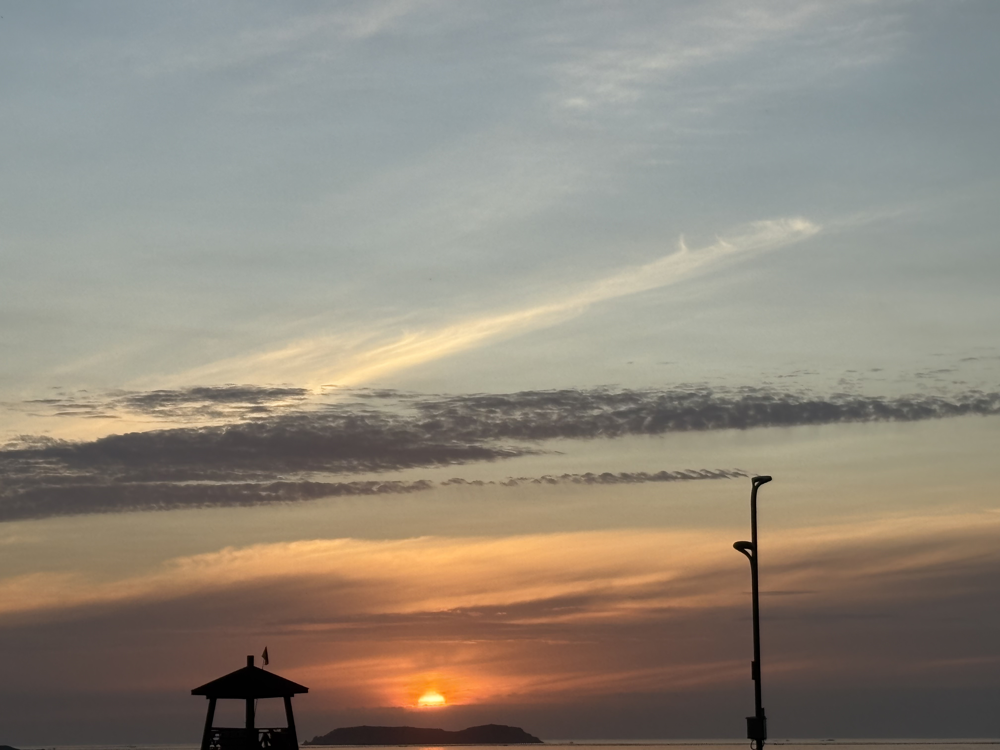
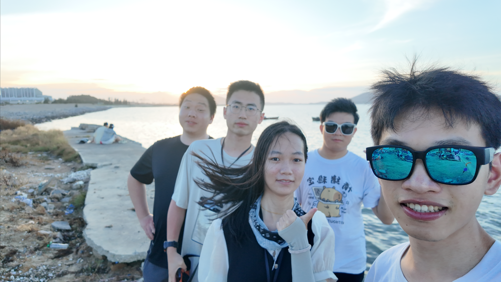

## 我（是谁？）

我，俞小金，03年生，江西省赣州市兴国县人，农村孩子，小时候很外向，对什么都很好奇，并且小时候觉得世界都围着自己转（特指小学）。但是到初中之后，仿佛世界改变了，周围的人不再贪玩，都变得紧绷，一直带有一种紧张的氛围。即使这样我还是结识了一群很好的朋友，虽然后面分班将一部分人打散，但是我还是很感激他们陪伴我度过了这个从小学无拘无束贪玩的时期转向压力十足的学习阶段。

在初中我第一次学习了物理，我就产生了浓厚的兴趣，比如反重力，这些兴趣促使我总是好高骛远，想学习一些高深的知识。到现在仍然记得但是想要参加初中的物理竞赛，但是我并没有一个老师来指导我学习，这使得我并没有在初中将我对于物理的兴趣保留下来。但是转机来了，高一入学，我遇到了我的班主任--朱新培老师，他讲课的方式以及理念，让我重新拾起了对于物理的兴趣。到了高二，文理分科，我与朱老师分开了，仍然记得在分别的时候，他对我说：你很有潜力。也许就是这句话，使得我后面拼了命的学习物理，但是同时我失去了一个名师。高二高三，我的成绩一直都处于中游，但是对于物理我一直有执念，我买了费曼讲义（但是完全看不懂）。高二寒假（疫情停课），我发愤学习了一个寒假，这一个寒假让我了解和学习到了许多我竞赛的知识，但是仍然不足以让我参加高中物理竞赛，就这样，最后我妥协了，放弃在高中对于物理的追求， 转向高考，最后大学如愿以偿选择了物理专业。

在经历高中和初中之后，我发现我丢失了我小时候那种好奇与自信，我不喜欢和身边的人交流，甚至不问老师问题。也许是环境导致。我想在大学我应该做出改变了！

大学，我的大学并不是什么211或者985，身边的人都没有这么有目标和勇气，这对于一个想要改变的我是致命的，因为这其实和以前一样，我在人群中总是一个异类，那么这时重要的是我有没有勇气像小时候一样，继续当这个异类，一个开放的异类。

或许上天看到了，让我遇见了许多想要向上的朋友，可能由于磁场相同（相同的电流相互吸引），感谢他们的陪伴。

### 大学：

当然在大学也有许多迷茫的时候，迷茫考试，迷茫学习应该怎么学，迷茫如何交友，迷茫未来，迷茫如何找到自己。在这个过程中我的一些经历如下：

### 经历（从前往后）：

首先一入学，我就开始收集各方面的有关于比赛的消息。通过学长推荐，我参加了学校里面的Cupt（物理学术创新竞赛），这个比赛我格外认真，题目是：圆柱形骰子。准备了差不多一个月，通过学长的启发，我第一次认识到了什么是量子力学（虽然我知道最后我的思路错了）。这个比赛最后的结果是我输给了一个数学系的。。

接下来沉淀了一年，这一年中学习了一定的python，然后遇到了自己的第二个机会---物理创新实验竞赛

#### 1.物理创新竞赛：

在这个比赛中，我们的目标是通过平面热源法来测量一个材料的导热系数，但是与传统想法不同的是，我们是通过制冷的方式测量导热系数。这个项目的难点，是制冷装置位置设计，以及温度数据的采集，这些问题我们都解决了，但是最后的数据处理出来的结果有一定的问题？有许多奇异点。结果也仍然不好。但是最大的收获是积累了一定的团队协作和数据处理的经验以及结识了几个志同道合的朋友。

#### 2. 量子人才培养计划

2023年，通过流浪地球2，我了解了量子计算这个非常前沿的学科（但是其实当时最令我震撼的是机器人集群---AI的执行力），这颗种子悄然种下，2023年暑假，我报了中科大的量子人才培养计划，起初我对于这个并不抱有期待，但是最后，也许老师被我的真诚打动了，让我参加了为期两个月的量子基础知识的学习。这是我第一次以研讨会的形式学习，每一节课都有一到两个人要讲内容，在这个过程中我结识到了许多优秀的同学，同时了解了一定的量子信息的基础知识，但是似乎当时的自己还没有成长到能够进行科研的地步，于是这个计划也就无疾而终了。

之后，带着之前累积的信心和勇气，继续向前学习。带着对于“懂量子力学的人都说不懂量子力学”困惑，我跟着陈童老师学习了量子力学，在这个过程中，也逐步地加深我对于量子世界的理解。

运气很好，一个学长知道我参加了这个计划，带着我参加一个量子计算的一个应用类的比赛，我们做的是一个基于量子性质的游戏

#### 3.量子应用与创新竞赛

我们要做的是将量子的规则加入到经典游戏点线棋里，我主要负责的是对于量子点线棋规则的制定，并参与游戏程序的编写。虽然最后我们是用经典计算机来实现的量子点线棋，但是这也让我意识到了量子世界的奇怪特性（可以通过经典模拟出量子的感觉）以及量子计算应用的复杂性。

#### 4. 2024年美国大学生数学建模竞赛

2023年底，我和我的两个朋友报名参加了美国大学生数学建模大赛（前一次我们只拿了一个参与奖，哈哈哈）。我们选择的题目是“水下潜水艇的预测问题”，我们对于这种预测问题，并不熟悉，但是通过AI，我们获取了一定的思路，最后我们通过Kalman滤波法，使用Matlab给出了预测模型（现在看来，做一个神经网络就好了）。但是结果是好的，我们拿了M奖，努力有了回报（其实我们都不报期待，有的时候不报期待，结果不会差）。

因为准备考研，所以准备了一年，这一年中参加了两个夏令营：南方科技大学和上海大学。

#### 5.南方科技大学和上海大学的夏令营：

这两个夏令营都让我更加了解我自己的情况（虽然我现在其实想做AI）。

南方科技大学量子院夏令营：我见识到了量子计算的原型机，但是由于不太喜欢组里的氛围（有点压抑），就没有去	。

上海大学夏令营：遇到了我现在的导师-胡晓老师，他的拓扑光子方向让我着迷（或许是但是的知识储备不够，其实并没有这么容易实现）

然后2024年底考研，2025年上岸

#### 6. 毕业旅游

6月份，毕业季，和同学到福建福州的平潭吹了吹海风，然后回到学校顺利毕业了，在家等待开学的同时，学习电动力学和算法，之后应该也会更新相应的笔记，希望能够写出一些有用的东西以及收获成长！

  

#### 7.现在：

研究生，我发现“孤独”是一个主旋律，自己吃饭，自己去工位，每天和AI科研，主动社交（认识了两个俄罗斯人，并且带着它们出去旅游），自己散步，自己打球，自己规划未来，自己发现问题并且反省。

现在的我是过去所有经验所塑造的，感谢过去的自己勇敢地做出改变，勇敢地走出去，同时感谢这么多朋友的陪伴，希望我们都能在更好的未来相遇，我也想努力推动这个时代，让它更早的到来。

小时候的我是人性最完整的我，我现在希望能够再次找到小时候的自己，对任何事情充满期待和好奇！未来已至，只是还未均匀。

## 联系方式：

### QQ：1796784184

### Wechat ：15970835051

### Mail：quantum511212@outlook.com
