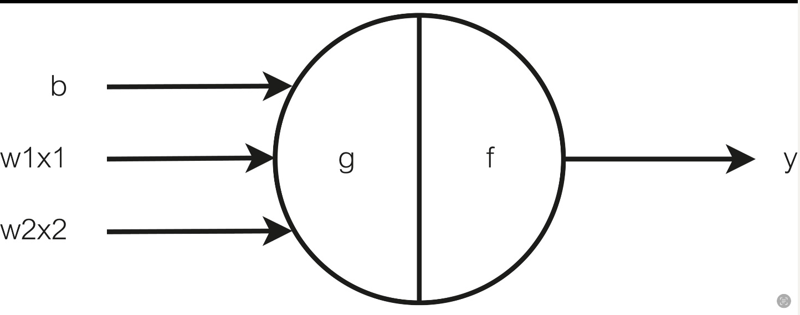

# Why machines learn？

## Chapter1:Deseperatly seeking pattern

### 从现象出发

这里面的pattern其实就是数据中某种模式特征，打个比方，每一个人对于每一年每一个季度的天气的理解和判断，都是基于一段时间（几年）的生活，通过观察每一年的天气（数据），然后得出一些经验（特征）。

然而令人惊讶的是，小小的鸭苗在没有父母的帮助下，也可以从运动的物体中找到一定的规律，这些规律可以是相似之处，也可以是不同之处，比如，小鸭苗如果看见有5个黑鸭苗和2个白鸭苗的队伍，它会知道自己是黑的还是白的，并且知道黑色和白色的差别，最后他会加入到其中一个队伍里面。

这就是令人惊讶的动物的学习能力。在早些年，就有科学家提出“动物（人）是怎么学习的”这一问题，他们就想到先从学习数据中的特征入手，于是就有科学家开发了Perceptron（感知机）来模拟人类的思考。当你给这个感知机下面这些数据的时候：

| $x_1$ | $x_2$ | $y$  |
| ----- | ----- | ---- |
| 4     | 2     | 8    |
| 1     | 2     | 5    |
| 0     | 5     | 10   |
| 2     | 1     | 4    |

我们只需要通过一点点的观察和心算就能够发现这组数据中存在的关系是：
$$
y = x_1+2x_2
$$

而对于现在的机器而言无非就是一个Regression算法，这个算法的意思是：你给他很多的train data（有input和output），然后它会通过学习这些数据来给出这些量之间的线性关系（$y =w_1x_1+w_2x_2+b$），也就是学习得到 $w_1,w_2$(系数，weight)以及偏差（截距）。

然后你可以通过一些测试数据来判读这一组系数的好坏（离最优的系数差多远，最优的系数当然是通过每一个数据点，但是实际上并不能很好的做到），最后得到这组数据的最优解，接下来你就可以通过这样的关系来predict不同的input，会有怎么样的output了。就好像天气一样，你可以通过之前每一天的数据来预测之后的数据一样，只不过天气与很多因素有关。

所以Regression Method的具体步骤是：

1. 给他一定的训练数据，并且指定一开始的 $w_1,w2，b$
2. 然后计算这一组的系数所给出的output $y_{predict}和y_{train}$之间的差距，然后通过这个差距反过来调节系数
3. 不断的执行，直到这个差距小到我们的要求为止

### 神经元的逻辑化

言归正传（Regression后面还会系统的说明），我们也许可以通过理解机器是怎么学习的来完全理解人类是怎么学习的（这里我的理解是我们可以在让机器逐步学会学习的过程中，不断地深化我们对于自己学习过程的理解）。

19世纪，图灵等科学家就认为logic和computation之间有很深厚的联系，他们断言“所有的计算都可以被简化为某种逻辑”。然后就引出了这样一个问题：既然人脑是可以执行计算的，那么它是怎么样执行逻辑操作的（它底层是否像逻辑门一样呢？）。

带着这样的问题，有生物学家通过类比一个神经元：

图中Dendrites就是神经元的树突，它负责接受各种刺激，树突中间的就是细胞体，他可以处理树突接受到的刺激（相当于进行计算），然后Axon（轴突）负责转递细胞体的结果到Axon terminals（端粒），端粒在将这个结果传递给周边其他的神经元。

然后生物学家希望把这一机构转化为一个简单的计算模型，理由是：他很像一个机器，你给他一个输入（刺激），他就会给输出。因此他们想要通过类比用神经元来构建逻辑AND，OR操作。

他们首先将这个神经元定义为这个样子：

上图的左侧就是给神经元的输入，然后中间的g，f就代表的是神经元对于输入的处理，然后再到右侧的输入y（其实我们可以在g，f的中间再加一个传输的过程，就是将g的处理结果传输到下一个f神经元处）。

然后这里假设 $x_1，x_2 \in {0,1}$,并且神经元会这样处理输入：

1. Sum  = x1+x2

2. If  $Sum\geq \theta :y=1$

   else:y = 0

所以这里我们就可以认为g其实就是对输入做了一个加法，而f函数就是对g的输出做了一个判断，但是这个 $\theta$要根据具体的情况而定的（这也是人脑的神秘之处），这一整个可以表示为：

$$
f(g(x)) =
\begin{cases}0, & g(x) < \theta \\\ 
1, & g(x) \geq \theta
\end{cases}
$$

有了这样的前提，我们就可以来设计基础的布尔逻辑门的操作了。

   首先对于AND逻辑来说：

   | x1   | x2   | sum  | x1 And x2 |
   | ---- | ---- | ---- | --------- |
   | 0    | 0    | 0    | 0         |
   | 0    | 1    | 1    | 0         |
   | 1    | 0    | 1    | 0         |
   | 1    | 1    | 2    | 1         |

   我们可以看到这么一个逻辑对于Sum小于等于1的输出都是0，而大于1的就是1，所以我们要神经元完成这个逻辑只需要将 $\theta = 2$ ,得到：

$$
f(g(x)) =
\begin{cases}0, & g(x) < 2 \\\ 
1, & g(x) \geq 2
\end{cases}
$$

对于OR逻辑操作也是同理，读者可以自行一试（答案是 $\theta=1$）。

   但是这里有一个比较有意思的问题：但神经元需要处理不同种类的逻辑的时候，他是如何调整这个 $\theta$的值呢？

Tips:下次记得分段公式要三条斜杆（调试了一上午）

## Learning From Mistakes：

我们常说，要从失败中汲取教训，这句话对于早期的Machine来说有所表现。早期Rosenblatt和Nagy 开发出的Mark I神经网络模型（就是根据前面的神经元模型建造的，这个名字让我想起Severance的Mark 🤣），这个模型能够识别图片的字母（20*20像素的图片）。但是据我们所知，光学识别系统也可以完成一样的工作，那么我们可以说它们是等价的吗？

不可以，因为Mark I的工作原理与光学识别系统之间还是有所不同。

**光学系统识别图片上的字母**（OCR）就像一个经过训练的侦探。它首先“清理”图像，使其更易于分析（预处理）。然后，“划分”图像，找到哪里有文本，并将文本分解成独立的字母（分割）。接着，“观察”每个字母的特点（特征提取），最后根据这些特点与已知字母的特征进行“对比”，从而确定这个字母是哪个（分类和识别）。

而Mark I识别图片中的字母则是通过学习，这个学习的过程是：每次当它错误的识别这个图像的时候，通过一定的反馈来学习如何识别图片的字母，本质上就是学习如何区分不同种类的字母。

那么，具体在Perceptron里面是如何实现的呢？算法上其实和前面的神经元很像，就像下图一样：

它的过程是这样的：

1. 首先计算 $Sum = w_1x_1+w_2x_2+b$，

2. 然后 If:  $Sum \leq 0 : y = 1$ ;

   ​	Else:   y  =-1.

整个过程可以简化为两个函数$g和f$，一个函数$g$负责做求和操作：
$$
g(\vec{x}) = \sum_{i=1}^{n} w_ix_i+b,\quad 其中\vec{x} = (x_1,\dots,x_n)
$$
然后函数f做判断：
$$
f(g(x)) =
\begin{cases}-1, & g(x) < 0 \\\ 
1, & g(x) \geq 0
\end{cases}
$$
我们可以看到这个操作与前面有一点不一样，但都是先对于输入进行一定的处理，然后进行判断。然后我们看看这样的操作可以如何区分不同的种类的字母。先举个例子：

如何判断一个人是否肥胖呢？首先，我们有一个用于训练的数据集${x_{train}=(x_1,x_2,index)}$，每个人都有特定的身高（$x_1$）和体重（$x_2$）以及是否肥胖的指标（index），例如一个人（100kg，160cm，1（是））就表示他体重100kg，身高160cm，属于肥胖人群。如果我们将瘦的人标记为三角形，胖的人标记为圆形，那么这个数据集在坐标轴就会如下图所示：

​      我们可以看到，Mark I在学习如何将这样的数据集分成两部分，即学习数据中的某种规律（学习这条separating line 的slope和bias），但是这样分类的学习有一定的前提：

1. 我们所提供的数据集是可以分的

并且这种通过training data学习到的分类模型，在面对不在training data里面的数据的时候并不能100%地做出正确的分类，这是因为，我们可以看到上图中，三角形所在的区域和圆形所在的区域之间存在很多条可以区分训练数据的直线，所以仅仅通过训练数据来训练这个分类模型是不够的，它还得用一些testing data来进行反馈（这里很像人，人在看了很久的书之后，你要让他在新的环境下去实践，才会提高人对于这本书的掌握。）

所以Learning from  mistake 还是有一定部分从人类角度的启发的。并且我们可以看到上面神经元最后的输出其实可以是任意的数，那就使得这个神经元可以做的事情很多了

本文原载于 [quantum51.top](https://quantum51.top)，遵循 CC BY-NC-SA 4.0 协议，复制请保留原文出处。
